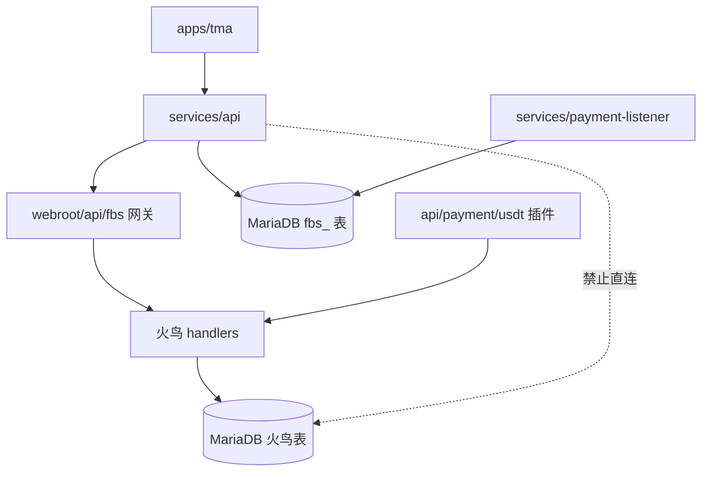
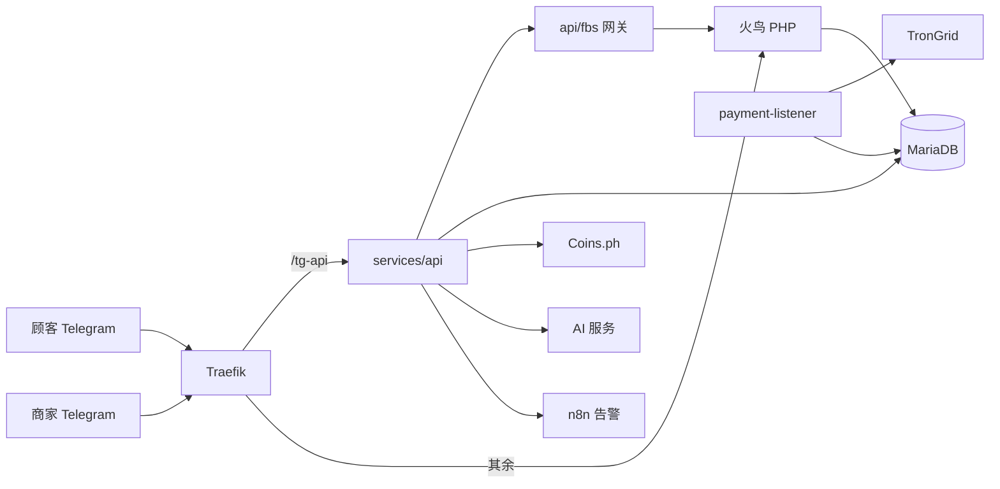

# Architecture Spine — firebird-sea

## Design Paradigm

**绞杀者模式（Strangler Fig）。** 火鸟 PHP 是店铺、菜品、订单的唯一真源，核心代码保持原样；新能力只通过两种方式加入：一是放在火鸟约定的扩展点上的薄 PHP 适配层，二是火鸟之外的 Node 服务，经一个受控网关与火鸟交互。

| 层 | 位置 | 职责 |
|---|---|---|
| 边缘 | Traefik | 路由 `/tg-api` 到 Node，其余到 PHP |
| 客户端 | `apps/tma` | Telegram Mini App，只调用 Node |
| 编排 | `services/api` | 登录、下单编排、收银台、对账、AI 上架、翻译 |
| 链监听 | `services/payment-listener` | 只读链上数据，写入链上流水表 |
| 适配 | `webroot/api/fbs/`、`webroot/api/payment/usdt/` | 网关与支付插件，薄层 |
| 真源 | 火鸟 `webroot/` | 订单、菜品、会员、状态机 |

## Invariants & Rules



### AD-1 — 火鸟是订单与菜品的唯一真源 `[ADOPTED]`
- **Binds:** FR-3、FR-9、FR-10、FR-12、FR-24
- **Prevents:** Node 与火鸟各自维护订单状态，数据分叉。
- **Rule:** Node 不得直接读写 `waimai_*` 表。创建订单、改状态、写菜品，一律经 AD-3 的网关调用火鸟 handlers。

### AD-2 — 沿用火鸟订单状态码，不新增码 `[ADOPTED]`
- **Binds:** FR-24、FR-25、FR-26
- **Prevents:** 两套状态词汇并存，cron 与后台页面读不懂新码。
- **Rule:** `waimai_order.state` 只使用火鸟已有码。FR-24 的逻辑状态按下表映射；"待退款、已退款"不占用订单状态码，记在 AD-7 的退款工单上。

| FR-24 逻辑状态 | 火鸟 state | 备注 |
|---|---|---|
| 待支付 | 0 | `deal()` 创建 |
| 已付款待接单 | 2 | 只能由 `order_paid` 触发 |
| 备餐中 | 3 | 商家接单 |
| 配送中 | 5 | 自家骑手，跳过 4 |
| 已完成 | 1 | |
| 已超时、已取消 | 6 | 超时由 `waimai_updateOrderState` 处理，宽限见 AD-9 |
| 待退款、已退款 | 订单为 6，退款进度在 `fbs_refund` | `refrundstate=1` 仅表示已退款 |

取消一律落在 state 6（未付超时、已付后拒单、接单超时、运营者异常取消），我们不使用 state 7。只要被取消的订单在 `pay_log` 中已付款（`state=1`），取消的同一次操作必须创建一条 `fbs_refund`（状态：待退款、已退款、已作废）。`[ASSUMPTION]` 火鸟 `cancelOrder()` 对已付订单的行为需在技术验证中确认。
### AD-3 — Node 到火鸟只经一个网关
- **Binds:** FR-3、FR-9、FR-10、FR-12、FR-13、FR-27
- **Prevents:** Node 模仿浏览器 Cookie 调 `ajax.php`，随火鸟升级而失效；各处各写一套调用。
- **Rule:** 网关位于 `webroot/api/fbs/`，请求带服务端 HMAC 签名与时间戳，网关在进程内调用火鸟 handlers（如 `deal()`、`peisong()`）。网关不含业务规则，只做参数校验、会员查找和调用，并对所有 `fbs_*` 表只读。订单状态变更统一走网关的 `transition(ordernum, from, to, actor)`，商家后台（`wmsj`）的原生按钮如果绕开它，须在 `docs/internal/patches/` 登记并改为调用或关闭。`[ASSUMPTION]` 该调用路径需先做一次技术验证（spike）。

### AD-4 — USDT 是火鸟支付插件，结算只走 `order_paid`
- **Binds:** FR-5、FR-6
- **Prevents:** 两处代码改"已付款"，或绕过 `pay_log` 导致分成与余额不入账。
- **Rule:** 插件位于 `webroot/api/payment/usdt/usdt.php`，实现 `get_code` 与 `respond`。链上确认后，唯一允许的结算动作是调用 `order_paid($ordernum, $txhash)`，它对 `pay_log.state=0` 幂等。任何代码不得直接把订单置为 2。`pay_log` 行由下单网关调用 `deal()` 时同步创建，`fbs_charge.ordernum` 与它一一对应；`reconcile()` 调用 `order_paid` 前先断言该行存在且 `state=0`。

### AD-5 — 链上账本由 Node 持久化在 MariaDB，表前缀 `fbs_`
- **Binds:** FR-5、FR-6、FR-7、FR-8
- **Prevents:** 订单池放内存，重启丢单、尾数重复占用。
- **Rule:** 使用已有的 MariaDB，不引入新数据库。表：`fbs_charge`（收银台）、`fbs_chain_tx`（链上转账）、`fbs_cursor`（扫描游标）、`fbs_refund`（退款工单）、`fbs_audit`（审计）、`fbs_role`（商家与店铺绑定）、`fbs_member_map`（Telegram 用户到火鸟会员的映射）、`fbs_draft_item`（待确认清单条目）、`fbs_i18n`（译文）、`fbs_outbox`（待投递的网关调用）。所有 `fbs_` 表只由 Node 写，网关与火鸟只读。

### AD-6 — 唯一性由数据库约束保证，金额用整数
- **Binds:** FR-5、FR-6
- **Prevents:** 进程内集合在并发和重启下失效；浮点误差造成对不上账。
- **Rule:** 应付金额以微 USDT 存为 BIGINT，汇率快照以十进制字符串存。`fbs_charge` 有字段 `holds_tail`，在 `expires_at` 之后再保持 30 分钟为 1，之后置空；对 `(payable_micro)` 在 `holds_tail=1` 时建部分唯一约束（或用生成列实现）。应付金额只由服务端按 `ceil(php_centavos * 10000 / rate) + tail_cents * 10000`（`php_centavos` 为比索的百分之一，`tail_cents` 为 1 到 90，`rate` 为每 1 USDT 的比索数） 生成，响应返回 `payable_micro`、`rate_str`、`rate_at`，前端禁止再计算。`fbs_chain_tx` 对 `(txid, event_index)` 建唯一约束。比索金额保留两位小数，与火鸟一致。

### AD-7 — 对账在一个事务里完成，监听器只写流水
- **Binds:** FR-6、FR-7、FR-26
- **Prevents:** 监听器和 API 各自改订单，竞态与重复入账。
- **Rule:** `payment-listener` 只读链并写 `fbs_chain_tx` 与 `fbs_cursor`。匹配与结算在 `services/api` 的 `reconcile()` 中：先在本地事务内用条件更新（`WHERE state=期望值`）把 `fbs_charge` 置为 `matched`，并写一条 `fbs_outbox`；再由投递任务调用网关的 `order_paid`，失败按 outbox 重试，恢复时以 `fbs_charge` 为准。失败或不匹配的转账写入 `fbs_refund` 的异常类型。只处理已固化确认的转账，合约、收款地址、金额必须同时匹配。

### AD-8 — 登录由 Node 验签并签发会话，火鸟会员按需映射
- **Binds:** FR-1、FR-27
- **Prevents:** Mini App 与火鸟各一套登录；伪造的用户身份。
- **Rule:** Node 校验 Telegram `initData`（签名加 `auth_date` 有效期），签发短期会话令牌。网关为首次登录的 Telegram 用户创建或查找火鸟会员，并把结果返回给 Node，由 Node 写入 `fbs_member_map`。角色只有顾客、商家、运营者，运营者来自配置白名单；商家来自运营者创建的店铺绑定。

### AD-9 — 路由前缀分离，修复 `/api` 冲突
- **Binds:** FR-5、FR-6
- **Prevents:** Traefik 把 `/api/payment/notify.php` 等火鸟回调路由到 Node，造成所有支付插件回调失效。
- **Rule:** Node API 统一使用前缀 `/tg-api`，`/api` 全部归 PHP。现有 `/api/*` 路由迁移到 `/tg-api/*`。尾数释放的宽限期（超时后 30 分钟）由 `fbs_charge` 记录，不依赖火鸟 cron。

### AD-10 — 译文存独立表，火鸟菜品表只存基础语言
- **Binds:** FR-2、FR-12、FR-14
- **Prevents:** 为三语去改火鸟核心表结构，升级即被覆盖；手工修改的译文被 AI 重译覆盖。
- **Rule:** `waimai_list.title` 存中文原名。英文与菲律宾语存入 `fbs_i18n(entity, id, lang, field, text, source, edited)`，`source` 为 `ai` 或 `human`，`edited=1` 的条目不被重译覆盖。Mini App 的菜单一律从 Node 读取，由 Node 合并译文。`edited` 只能由商家的编辑动作置为 1。

### AD-11 — AI 输出是不可信输入，价格只经商家确认写入
- **Binds:** FR-11、FR-12、FR-13、FR-28
- **Prevents:** AI 误识的价格直接上架；提示注入驱动写操作。
- **Rule:** AI 只写入 `fbs_draft_item`（待确认清单）。清单条目经商家逐条确认后，由 Node 依序执行：通过网关创建菜品并取得菜品 id，再在同一本地事务内写入 `fbs_i18n`；确认之前不写 `fbs_i18n`。AI 调用代码不持有订单、资金接口的任何调用权限。

### AD-12 — 所有状态变更幂等且可审计
- **Binds:** FR-3、FR-6、FR-9、FR-10、FR-25、FR-27
- **Prevents:** 重试与并发造成重复订单、重复退款。
- **Rule:** 创建类接口要求幂等键；状态变更必须是条件更新；每次变更写入 `fbs_audit`（操作者角色、ID、动作、对象、时间）。

### AD-13 — 配置只来自环境，生产启动自检
- **Binds:** FR-1、FR-5、FR-28
- **Prevents:** 生产误用演示令牌或占位符收款地址；`mock-webhook` 被滥用。
- **Rule:** 服务启动时检查必填环境变量，生产环境发现演示令牌或占位符收款地址即拒绝启动。`mock-webhook` 仅在非生产环境注册。Helm 必须给 api 与 listener 注入 Telegram、Coins.ph、TronGrid 的密钥。

### AD-14 — 火鸟核心不改；扩展放自己的目录，补丁须登记
- **Binds:** all
- **Prevents:** 对商业源码的零散修改在官方升级时丢失且无人知晓。
- **Rule:** 自有 PHP 只放在 `webroot/api/fbs/` 与 `webroot/api/payment/usdt/`。外卖模块文件先作为独立的"原样入库"提交，我们的修改另提交。必须改核心时，在 `docs/internal/patches/` 登记补丁说明。

### AD-15 — 测试与发布门槛
- **Binds:** all
- **Prevents:** 资金路径无测试上线；CI 不跑测试。
- **Rule:** Node 服务使用内置 `node:test`，核心对账、尾数分配、状态转移必须有测试；CI 增加 `npm test`。新增依赖（当前仅计划 `mysql2`）须过 Zero-Dep 人工确认。

### AD-16 — 火鸟单体加外置服务，不拆微服务 `[ADOPTED]`
- **Binds:** all
- **Prevents:** 为"上微服务"而拆分火鸟（单一代码库、共享数据库与会话、加密加载器），成本远超收益并破坏官方升级路径；同时防止随手新增部署单元。
- **Rule:** 每个站点的部署单元固定为：`firebird-<site>`（php-fpm 与 nginx，含火鸟全部模块与插件）、`firebird-api-<site>`（Node 编排）、`payment-listener-<site>`（副本数 1，更新策略为 Recreate）、`fbs-cron-<site>`（CronJob）。新业务能力只能进入 Node 服务或 AD-14 的薄 PHP 层。除非有独立扩缩容或独立发布节奏的证据，不得新增部署单元。

### AD-17 — 可写状态必须落在持久化介质上
- **Binds:** FR-8、FR-11、FR-12
- **Prevents:** 上传的图片、会话和日志放在 `emptyDir` 或容器文件系统，重启即丢，多副本之间不一致。
- **Rule:** 火鸟的可写目录按用途划分：上传与附件使用 PVC（或火鸟支持的对象存储）；模板缓存留在 `emptyDir`（可重建）；会话改存 Redis 或在入口做粘性；日志输出到标准输出。上述完成前 PHP 副本数保持 1。

### AD-18 — 计划任务由集群 CronJob 触发
- **Binds:** FR-8、FR-25
- **Prevents:** 火鸟的计划任务（订单超时、自动派单、超时提醒）在集群里无人触发。
- **Rule:** `fbs-cron-<site>` 每分钟在 PHP 镜像中执行 `php include/cron.php`，环境变量与 PHP 容器一致。Node 侧的超时、outbox 投递和告警用自身定时器，单副本下运行；多副本前必须加租约或 `GET_LOCK`（MariaDB 10.5 没有 `SKIP LOCKED`）。

### AD-19 — 网关只在集群内可达
- **Binds:** FR-3、FR-9、FR-10、FR-12
- **Prevents:** `webroot/api/fbs/` 经公网暴露，成为绕过 Telegram 登录的入口。
- **Rule:** IngressRoute 与 nginx 对外拒绝 `/api/fbs/`；Node 通过 ClusterIP 服务 `firebird-<site>` 在集群内调用，并带 HMAC 签名。

## Consistency Conventions

| Concern | Convention |
| --- | --- |
| 命名 | Node 文件 `kebab-case.js`；表 `fbs_` 前缀、`snake_case`；API 路径 `/tg-api/v1/...` |
| 数据与格式 | 时间用 UTC ISO 8601，展示按 `Asia/Manila`；金额见 AD-6；响应 `{ success, data?, error?: { code, message } }` |
| 状态与横切 | 错误用稳定的 `code` 字符串；日志为 JSON，必带 `ordernum` 或 `chargeId`；密钥只读环境变量 |
| 语言 | 界面三语，缺失回退英文；代码标识符英文 |

## Stack

| Name | Version |
| --- | --- |
| PHP（火鸟） | 7.4-fpm-alpine，带 Swoole Loader，不得升级 |
| MariaDB | 10.5 |
| Redis | 7 |
| Node.js | 20（已过官方维护期，沿用现状，升级后置） |
| Express | 4.x |
| 链与代币 | TRON，USDT TRC-20，经 TronGrid 只读接口 |
| 汇率源 | Coins.ph USDT/PHP 买卖价 |
| 路由与发布 | Traefik IngressRoute、Helm、ArgoCD |
| `mysql2`（待批准新增） | 以安装时最新稳定版为准 |

## Structural Seed



```text
apps/tma/                      # Mini App
services/api/src/              # routes/ domain/ gateway-client/ db/ ai/
services/payment-listener/     # 只读链监听
webroot/api/fbs/               # 网关（薄）
webroot/api/payment/usdt/      # 支付插件
docs/internal/patches/         # 对火鸟核心的补丁登记
```

核心实体（名称与关系）：`fbs_charge` 一对一关联火鸟 `ordernum`；`fbs_chain_tx` 多对一关联 `fbs_charge`；`fbs_refund` 多对一关联 `ordernum`；`fbs_i18n` 按 `(entity, id, lang, field)` 关联火鸟菜品。

## Capability → Architecture Map

| Capability / Area | Lives in | Governed by |
| --- | --- | --- |
| FR-1、FR-27 登录与授权 | `services/api`、`fbs_role` | AD-8、AD-12 |
| FR-2、FR-14 三语 | `fbs_i18n`、`services/api` | AD-10 |
| FR-3、FR-9、FR-10、FR-24、FR-25 订单与状态 | 火鸟 handlers，经网关 | AD-1、AD-2、AD-3、AD-12 |
| FR-5、FR-6、FR-7、FR-8、FR-26 付款、对账、退款 | `services/api`、`payment-listener`、USDT 插件、`fbs_*` | AD-4、AD-5、AD-6、AD-7、AD-9 |
| FR-11、FR-12、FR-13 AI 上架 | `services/api/ai`、待确认清单表 | AD-10、AD-11 |
| FR-28 密钥与收款地址 | 环境、Helm | AD-13、AD-14 |

## Deferred

- 微服务拆分：已评估并否决（AD-16），仅在出现独立扩缩容或独立发布节奏的证据时重评。
- 与 `zxem` 命名空间共用的数据库与 Redis：线上 `mysql.zxem.svc` 与 `redis.zxem.svc` 是另一套系统的实例。爆炸半径与资源争抢的处理（独立实例或托管数据库）后置，前提是每日备份和独立库与用户。

- Mini App 前端栈：`apps/tma` 已有 Vite 6，具体框架在首个前端 Story 中决定。
- AI 服务商与模型、月度成本上限：在 AI 上架 Story 中决定。
- 兑换（FR-16 到 FR-21）与 AI 新闻（FR-22、FR-23）：v1.1 再开独立架构切片。
- Node 升级到当前维护版本：后置，不阻塞 v1。
- TON、BEP-20 等其他链：不在范围内。
- 多城市（宿务）的数据隔离：沿用 Helm 分站，待第二个站点时再定。
