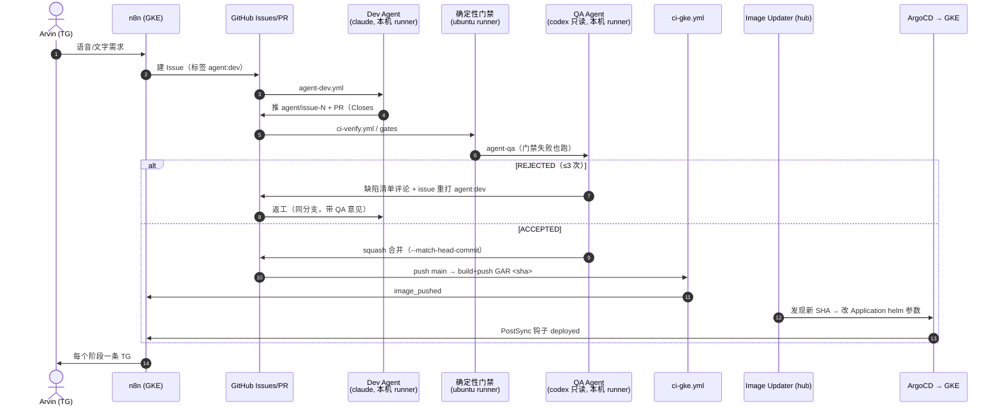

# 多 Agent 研发流水线（n8n → GitHub CI → ArgoCD CD）

> 最后更新：2026-10-09 · 落地 `BMAD_AUTOMATION_PIPELINE_ARCHITECTURE.md` 的方案 C（外环 n8n / 内环 GitHub + 双 Agent）。

## 1. 全链路



## 2. 组件与文件

| 环节 | 位置 | 说明 |
|---|---|---|
| 需求入口 | `automation/n8n/workflows/tg_to_github_issues_project.json` | TG → Gemini 脱水 → Issue，自带 `agent:dev` |
| 事件播报 | `automation/n8n/workflows/agent_pipeline_events_to_tg.json` | Webhook `POST /webhook/firebird-agent-event` → TG |
| Dev Agent | `.github/workflows/agent-dev.yml` → `scripts/agent/dev.sh` | 默认 `claude -p`，限定工具集，不能改 `.github/`、`scripts/agent/` |
| 确定性门禁 | `.github/workflows/ci-verify.yml` → `scripts/agent/gates.sh` | 只看分支 diff：非空、增量 ≤300、Docs-as-Code、Zero-Dep、密钥、调试残留、语法、Helm |
| QA Agent | `ci-verify.yml` job `agent-qa` → `scripts/agent/qa.sh` | 默认 `codex exec -s read-only`（与 Dev 不同厂商）；JSON 裁定，解析失败即打回 |
| 构建 | `.github/workflows/ci-gke.yml` | push main → GAR `firebird-php/api:<sha>`；纯 docs/任务变更不构建 |
| 发布 | homelab `platform/argocd-image-updater` + `apps/firebird-manila/application-gke.yaml` | Image Updater v1（CRD）追 40 位 SHA tag，write-back=argocd；Application 自动同步 |
| 上线通知 | `deploy/helm/firebird-site/templates/job-notify-deployed.yaml` | ArgoCD PostSync Job，`deployNotify.webhook` 为空则不创建 |

## 3. 标签状态机

| 标签 | 含义 | 谁打 |
|---|---|---|
| `agent:dev` | 待 Dev Agent 施工（打上即触发） | n8n / 人 / QA 打回 |
| `agent:qa` | PR 等待 QA | Dev Agent |
| `qa:accepted` / `qa:rejected` | QA 裁定 | QA Agent |
| `agent:blocked` | 空交付或打回 ≥ `AGENT_MAX_ATTEMPTS`，需人工 | Dev Agent |

## 4. 配置（GitHub → Settings → Secrets and variables → Actions）

| 类型 | 名称 | 必填 | 说明 |
|---|---|---|---|
| secret | `AGENT_GH_TOKEN` | ✅ | fine-grained PAT（本仓库 Contents / Issues / Pull requests 读写）。**不能用 `GITHUB_TOKEN`**：它推的提交/开的 PR/打的标签不会触发后续 workflow |
| var | `N8N_AGENT_EVENT_WEBHOOK` | 建议 | `https://n8n.k8shome.com/webhook/firebird-agent-event` |
| var | `AGENT_AUTO_MERGE` | | 默认 `1`；设 `0` 即改为「QA 通过后人工合并」 |
| var | `AGENT_MAX_ATTEMPTS` | | QA 打回上限，默认 `3` |
| var | `DEV_AGENT_CMD` / `QA_AGENT_CMD` | | 覆盖默认 agent 命令（提示词均走 stdin；`QA_AGENT_CMD` 需以输出文件参数结尾，如 `... -o`） |
| secret | `GCP_SA_KEY` | ✅ | 已有，CI 推 GAR |

本机 runner：`scripts/agent/setup-runner.sh`（标签 `firebird-agent`，launchd 常驻，复用本机 claude/codex 登录态）。

## 5. 安全边界

- 仓库是**公开**的，而 Agent 跑在本机自托管 runner 上，因此：
  - `agent-dev` 只响应 `sender == 仓库 owner` 的 `agent:dev` 标签，或 owner 本人的 `workflow_dispatch`；
  - n8n TG Trigger 限定 chat/user ID = Arvin 本人。**这一条是闸门的前提**：n8n 用 owner 的 OAuth 建 Issue，
    若不限制发送人，任何给 bot 发消息的人都能以 owner 身份触发 Dev Agent 并一路自动合并上线；
  - `agent-qa` 只对本仓库 `agent/*` 分支运行，拒绝 fork PR（`qa.sh` 二次校验 `isCrossRepository`）；
  - 建议在 Settings → Actions 开启「Require approval for all outside collaborators」。
- Dev Agent 的产出里对 `.github/` 和 `scripts/agent/` 的改动会被丢弃，不能篡改自己的考官。
- 自动合并带 `--match-head-commit`：QA 之后再推的提交不会被带进 main。
- 门禁拦截私钥 / 助记词 / TG Bot Token 进入 diff（RULES 资金安全禁区）。

## 6. 运维

```bash
make agent-dev ISSUE=12     # 本地手动跑一次 Dev Agent（需 gh 登录）
make agent-qa PR=34         # 本地手动跑一次 QA
make gates                  # 当前分支对 origin/main 跑确定性门禁

# 发布状态 / 回滚（hub 集群）
kubectl --context mac-mini-orbstack -n argocd get imageupdater firebird-manila
argocd app history firebird-manila
argocd app rollback firebird-manila <ID>   # 回滚后 Image Updater 仍会追最新 tag：
                                           # 先 kubectl -n argocd patch imageupdater firebird-manila 暂停，或 revert main
```

暂停全自动：`AGENT_AUTO_MERGE=0`（保留 QA，只停合并）；或删 issue 上的 `agent:dev` 标签。
