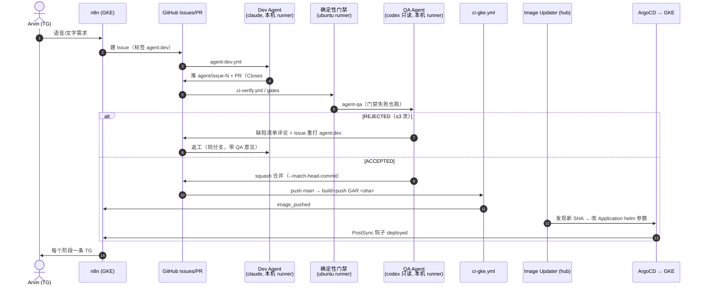

# 多 Agent 研发流水线（n8n → GitHub CI → ArgoCD CD）

> 最后更新：2026-10-09 · 落地 `BMAD_AUTOMATION_PIPELINE_ARCHITECTURE.md` 的方案 C（外环 n8n / 内环 GitHub + 双 Agent）。

## 1. 全链路



## 2. 组件与文件

| 环节 | 位置 | 说明 |
|---|---|---|
| 需求入口 | `automation/n8n/workflows/tg_to_github_issues_project.json` | TG → Gemini 脱水 → Issue，自带 `agent:dev` |
| 事件播报 | `automation/n8n/workflows/agent_pipeline_events_to_tg.json` | Webhook `POST /webhook/firebird-agent-event` → TG |
| Dev Agent | `.github/workflows/agent-dev.yml` → `scripts/agent/dev.sh` | 默认 `claude -p`，限定工具集，不能改 `.github/`、`scripts/agent/` |
| 确定性门禁 | `.github/workflows/ci-verify.yml` → `scripts/agent/gates.sh` | 只看分支 diff：非空、增量 ≤1200、Docs-as-Code、Zero-Dep、密钥、调试残留、语法、Helm |
| QA Agent | `ci-verify.yml` job `agent-qa` → `scripts/agent/qa.sh` | 默认 `codex exec -s read-only`（与 Dev 不同厂商）；JSON 裁定，解析失败即打回 |
| 构建 | `.github/workflows/ci-gke.yml` | push main → GAR `firebird-php/api:<sha>`；纯 docs/任务变更不构建 |
| 发布 | homelab `platform/argocd-image-updater` + `apps/firebird-manila/application-gke.yaml` | Image Updater v1（CRD）追 40 位 SHA tag，write-back=argocd；Application 自动同步 |
| 上线通知 | `deploy/helm/firebird-site/templates/job-notify-deployed.yaml` | ArgoCD PostSync Job，`deployNotify.webhook` 为空则不创建 |

## 3. 标签状态机

| 标签 | 含义 | 谁打 |
|---|---|---|
| `agent:dev` | 待 Dev Agent 施工（打上即触发） | n8n / 人 / QA 打回 |
| `agent:qa` | PR 等待 QA | Dev Agent |
| `qa:accepted` / `qa:rejected` | QA 裁定 | QA Agent |
| `agent:blocked` | 空交付或打回 ≥ `AGENT_MAX_ATTEMPTS`，需人工 | Dev Agent |

## 4. 配置（GitHub → Settings → Secrets and variables → Actions）

| 类型 | 名称 | 必填 | 说明 |
|---|---|---|---|
| secret | `AGENT_GH_TOKEN` | ✅ | fine-grained PAT（本仓库 Contents / Issues / Pull requests 读写）。**不能用 `GITHUB_TOKEN`**：它推的提交/开的 PR/打的标签不会触发后续 workflow |
| var | `N8N_AGENT_EVENT_WEBHOOK` | 建议 | `https://n8n.k8shome.com/webhook/firebird-agent-event` |
| secret | `N8N_AGENT_EVENT_TOKEN` | 建议 | 事件 webhook 的 Header Auth token（`X-Firebird-Token`），与下方 n8n 凭据、GKE Secret 三处一致 |
| var | `AGENT_AUTO_MERGE` | | 默认 `1`；设 `0` 即改为「QA 通过后人工合并」 |
| var | `AGENT_MAX_ATTEMPTS` | | QA 打回上限，默认 `3` |
| var | `DEV_AGENT_CMD` / `QA_AGENT_CMD` | | 覆盖默认 agent 命令（按 shell 语法 `eval` 成数组，**等同于在 runner 上执行任意命令**——仅 owner 可设，勿开放给他人；提示词走 stdin；`QA_AGENT_CMD` 需以输出文件参数结尾，如 `... -o`） |
| secret | `GCP_SA_KEY` | ✅ | 已有，CI 推 GAR |

本机 runner：`scripts/agent/setup-runner.sh`（标签 `firebird-agent`，launchd 常驻，复用本机 claude/codex 登录态）。

n8n / GKE 侧：
- 导入 `agent_pipeline_events_to_tg.json` 后：Webhook 节点绑定 **Header Auth** 凭据（Name `X-Firebird-Token`，Value = 上面的 token），Telegram 节点绑定 Bot 凭据，**然后激活**——未激活时生产 webhook 路径 404，CI 与 PostSync 通知会静默失败。
- `tg_to_github_issues_project`：TG Trigger 必须是 **typeVersion 1.2** 且填 Restrict to Chat/User IDs；Agent 节点为 `promptType=define`，后接「2b. 解析 Spec JSON」Code 节点。
- GKE `default` 命名空间：`kubectl --context gcp-gke -n default create secret generic firebird-n8n-event-token --from-literal=token=<同一 token>`（PostSync 通知 Job 读取，缺失时不带鉴权头）。

## 5. 安全边界

- 仓库是**公开**的，而 Agent 跑在本机自托管 runner 上，因此：
  - `agent-dev` 只响应 `sender == 仓库 owner` 的 `agent:dev` 标签，或 owner 本人的 `workflow_dispatch`；
  - n8n TG Trigger（**typeVersion ≥ 1.2**，1.1 只显示该选项、运行时不过滤）限定 chat/user ID = Arvin 本人。**这一条是闸门的前提**：n8n 用 owner 的 OAuth 建 Issue，
    若不限制发送人，任何给 bot 发消息的人都能以 owner 身份触发 Dev Agent 并一路自动合并上线；
  - `agent-qa` 只对本仓库 `agent/*` 分支运行，拒绝 fork PR（`qa.sh` 二次校验 `isCrossRepository`）；
  - 建议在 Settings → Actions 开启「Require approval for all outside collaborators」。
- Dev Agent 不能篡改考官，三层防护：
  1. 施工后对 `.github/`、`scripts/agent/`、`.agents/` 执行 `git checkout` + `git clean`（已跟踪改动与**新增文件**都丢弃）；
  2. Agent 分支上 gates 的「受保护路径未改动」检查；
  3. QA 的脚本、`gates.sh`、`RULES.md` 一律取自 main（agent-qa 检出 base 分支并 `self_copy`），PR 代码只作为被审数据。
- Agent 进程不持有任何凭据：checkout 使用 `persist-credentials: false`，运行 agent 时清空 `GH_TOKEN` 等环境变量（`agent_env`），推送时才由 `gh auth git-credential` 临时提供。
- Dev Agent 工具白名单仅 `Read(./**)`、`Edit(./**)`、`Grep(./**)`、`Glob(./**)`（裸 Grep/Glob 实测可读仓库外），**不放行任何 Bash**（`node --check:*` 之类前缀规则可借 `-r` 等参数执行任意代码）；仓库外读写实测被拒。
- `.git` 防护：施工前快照 `.git/config`，施工后还原并清空 `.git/hooks`；之后的 git 调用一律 `-c core.hooksPath=/dev/null -c core.fsmonitor=false`，commit/push 加 `--no-verify`。
- 所有发到公开 PR / Issue 的 agent 输出先经 `redact` 脱敏（GitHub token、Authorization 头、私钥块、TG bot token）。
- 合并需同时满足：托管 runner 上的 gates job = success（`GATES_JOB_RESULT`）、本地复跑门禁通过、QA 无 blocker/major。本机缺 php/helm 时门禁记为 SKIP，以托管 runner 结果为准。
- 自动合并带 `--match-head-commit`：QA 之后再推的提交不会被带进 main。
- 门禁拦截私钥 / 助记词 / TG Bot Token 进入 diff（RULES 资金安全禁区）。
- **依赖批准清单**：Zero-Dep 门禁放行 `.agents/approved-deps.txt`（每行 `包名 版本串`，如 `mysql2 3.24.5`，`#` 起注释）中**名称与版本串都完全一致**的新增依赖。清单取自 **base 分支**，同一 PR 自己登记自己无效；清单在受保护路径 `.agents/`，只能 Arvin 提交。版本变化需重新登记。
- **测试先行用例受保护**：`scripts/acceptance/` 对 Agent 分支同样受保护（dev.sh 丢弃改动、gates 判 FAIL），Agent 不能改写「验收标准」来让自己变绿，见 [TEST_FIRST.md](TEST_FIRST.md)。
- `_bmad-output/`（BMAD 规划产物）与 `docs/`、`.agents/` 一样不计入 1200 行增量。
- 门禁自测：`scripts/test-gates.sh`（临时仓库内验证批准清单 / 受保护路径 / 增量豁免）。

## 5b. BMAD Story 增强（dev.sh）

Issue 标题含 `[story:<key>]`（或正文 `<!-- bmad-story: KEY -->`）时，dev.sh 额外：
1. 从 origin/main 读取 `_bmad-output/implementation-artifacts/spec-N-M-*.md` 注入提示词（最多 20KB）；
2. **测试先行预检**（仅首轮「新建」）：以无凭据环境对 main 运行 `scripts/acceptance/run.sh --expect-red`；用例已绿 → Issue 打 `agent:blocked` 并留言、不施工；缺用例/缺工具 → 只警告；
3. 要求 Agent 结束时输出「验收清单」（逐条 AC → 文件/测试 → 已满足/未满足），并随 PR 正文的「Dev Agent 自述」发布（Story 取末 80 行）；
4. `scripts/acceptance/` 与 `.github/`、`scripts/agent/`、`.agents/` 一样，施工后强制还原。
无标记的普通 Issue 行为不变。详见 [TEST_FIRST.md](TEST_FIRST.md)。

## 5c. 机器验证与回写（ci-verify / writeback）

- `ci-verify.yml` 三个 job：`gates`（确定性门禁 + Helm 渲染 + Story 验收用例）、`verify-task`（`CI=true scripts/verify-task.sh`：流程脚本自测 + `services/api` 单测 + `scripts/test-api-db.sh` 数据库集成测试；ubuntu runner 自带 docker，脚本内另补 PATH 并在缺 docker 时明确失败）、`agent-qa`。QA 的 `GATES_JOB_RESULT` = gates 与 verify-task 都为 success 才算 success，**qa.sh 无需改动**。
- `services/api` 与 `scripts/test-api-db.sh` 入库前，verify-task 的 6、7 步自动跳过。
- `bmad-sprint-writeback.yml`：agent PR 合并且标题含 `[story:<key>]` → 开 `bmad/sprint-done-<N-M>-pr<PR>` 分支与 PR，仅改 `sprint-status.yaml`（不直推 main）；回写 PR 由人合并。标题经 env 传入，不拼进脚本。

## 6. 运维

```bash
make agent-dev ISSUE=12     # 本地手动跑一次 Dev Agent（需 gh 登录）
GATES_JOB_RESULT=success make agent-qa PR=34   # 本地手动跑一次 QA（须声明托管 gates 已通过，否则一律打回）
make gates                  # 当前分支对 origin/main 跑确定性门禁

# 发布状态 / 回滚（hub 集群）
kubectl --context mac-mini-orbstack -n argocd get imageupdater firebird-manila
argocd app history firebird-manila
argocd app rollback firebird-manila <ID>   # 回滚后 Image Updater 仍会追最新 tag：
                                           # 先 kubectl -n argocd patch imageupdater firebird-manila 暂停，或 revert main
```

暂停全自动：`AGENT_AUTO_MERGE=0`（保留 QA，只停合并）；或删 issue 上的 `agent:dev` 标签。

## 7. 已知限制

- php 与 api 两个镜像由 Image Updater 各自独立追踪，CI 先推 php 后推 api，最长约一个检查周期（2 分钟）内两者版本可能错位；chart 改动（`targetRevision: main`）会先于镜像生效。当前两者接口兼容，若将来出现不兼容变更，需改为单一触发 tag 或写回 git。
- Dev / QA 均为 LLM，存在被需求文本或 diff 中的提示词注入影响的可能；入口已限定为 Arvin 本人（TG chat/user ID、GitHub owner），QA 采用异厂商模型与 fail-closed 解析降低风险。


## 8. 依赖批准记录

批准清单见 `.agents/approved-deps.txt`（机制见 §5）。首批登记：`mysql2 3.24.5`（Story 2.1，AD-5）、`express ^4.21.2`（既有依赖）。
