# 主题研讨：BMAD 闭环全链路自动化落地架构 (n8n vs GitHub Actions vs 双 Agent)

> **核心议题**：
> 从“手机 TG 随口语音”到“GKE 自动上线闭环”，全流程究竟该由谁驱动？
> 是用纯 n8n 搞定一切？还是纯靠 GitHub？怎样设计才能既不失一人团队的极致敏捷，又绝对杜绝“开发与验收同体”的系统自嗨？

---

## 一、 方案选型深度推演 (Trade-off Analysis)

### 方案 A：纯 n8n 一包到底 (All-in-n8n)
* **设计思路**：
  TG 接收 ➔ n8n 调大模型 ➔ n8n 建 Issue ➔ n8n 调本地 Agent 跑代码 ➔ n8n 跑测试 ➔ n8n 调 GKE 部署。
* **致命痛点**：
  1. **长耗时与重任务崩塌**：n8n 强在 I/O 事件流编排，弱在长耗时任务。AI Agent 编码、读多文件、多轮推理通常需要 2~5 分钟，放入 n8n 极易触发执行超时或内存泄漏。
  2. **缺少标准沙箱**：让 n8n 执行本地 shell 来跑测试，缺乏代码审查隔离与可重现的容器环境。
* **结论**：**不可取**。会导致 n8n 工作流变成难以维护的“意大利面条式”胶水巨石。

---

### 方案 B：纯 GitHub 体系驱动 (All-in-GitHub Actions)
* **设计思路**：
  在 GitHub 网页提 Issue ➔ GitHub Actions 跑 AI 编码 ➔ GitHub PR 跑测试 ➔ GKE 上线。
* **致命痛点**：
  1. **手机端输入摩擦极大**：人在外或碎片时间，无法顺畅在手机 GitHub App 里写规范 Markdown。
  2. **无法做高频即时通讯反馈**：资金链上超时、Sentry 生产报警等场景，无法像 Telegram 一样毫秒级直达你手中。
* **结论**：**不适合一人团队的随身机动性**。

---

### 方案 C：黄金分割律 —— “外环 n8n 前哨 + 内环 GitHub/CI 施工”【强烈推荐】

将全链路明确切分为两道闭环：
- **外环（前哨枢纽）**：**n8n** 充当“贴身秘书与通讯总管”，负责把非结构化语音变成规整的 GitHub Issue，并负责最后在 TG 汇报。
- **内环（施工与质检）**：**GitHub Actions + 双 Agent 脚本** 充当“工程施工队与独立验收红队”，负责代码修改、隔离测试与云端发布。

```mermaid
sequenceDiagram
    autonumber
    actor Boss as 你 (独立总指挥)
    participant TG as Telegram Bot
    participant n8n as n8n 自动化中枢
    participant GH as GitHub Project / Issues
    participant DevAgent as Agent 1: Dev Agent (编码者)
    participant QAAgent as Agent 2: Acceptance Agent (质检红队)
    participant GKE as GKE / Helm (发布环境)

    Boss->>TG: 1. 随口发一段语音 ("外卖订单接入 Coins.ph 实时比索汇率")
    TG->>n8n: 2. 实时推送 Webhook
    n8n->>n8n: 3. Whisper 转录 + LLM 结构化提炼为标准 Spec
    n8n->>GH: 4. 创建 GitHub Issue (自动打标: epic/payment, priority/high)
    GH->>Boss: 5. TG 回传已确认卡片 (附带 Issue 链接)
    
    rect rgb(30, 41, 59)
    note right of GH: 【内环自动化工程施工】
    GH->>DevAgent: 6. 自动分配任务, 自动检出 feat/issue-xxx
    DevAgent->>DevAgent: 7. 编写业务代码, 同步补齐 Docs, 提交 PR
    DevAgent->>GH: 8. 创建 Pull Request (标记等待验收)
    end

    rect rgb(15, 23, 42)
    note right of QAAgent: 【独立红队验收卡点】
    GH->>QAAgent: 9. PR 触发独立验收工作流 (agent-accept.sh)
    QAAgent->>QAAgent: 10. 执行边界测试、Coins.ph 盘口探针、Docs 卡点
    alt 验收失败 (REJECT)
        QAAgent->>GH: 11a. 在 PR 留下缺陷证据，自动把 Issue 退回 In Progress
    else 验收通过 (PASS)
        QAAgent->>GH: 11b. 在 PR 签发 ACCEPTED 报告并自动 Merge
    end
    end

    GH->>GKE: 12. 触发 ci-gke.yml 自动升级 Helm Chart
    GKE->>n8n: 13. 发送 deployment_status 回调
    n8n->>TG: 14. 手机弹出通告: "🚀 任务已在 GKE 成功上线闭环！"
```



---

## 二、 落地实施的 4 个核心构件

### 1. n8n 负责的节点：极简轻量
- **Node 1: Telegram Webhook**（监听个人私聊消息或语音文件）。
- **Node 2: OpenAI / Gemini Audio Transcribe**（语音转文本）。
- **Node 3: LLM Spec Extractor**（输出固定 JSON：`{ title, epic, priority, criteria }`）。
- **Node 4: GitHub Node**（调用 GitHub API 往你的 Repo 新建 Issue，并加入 GitHub Project 的 `📋 Backlog` 列）。

### 2. GitHub Project 看板列设计 (清晰的状态流转)
| 列名 | 英文状态 | 驱动主体 | 触发事件 |
| :--- | :--- | :--- | :--- |
| **1. 需求池** | `Backlog` | n8n | TG 录入需求自动进池 |
| **2. 编码中** | `In Progress` | Dev Agent | Agent 认领任务，检出分支并拉代码 |
| **3. 独立验收** | `In Review / QA`| PR 触发 | Dev Agent 提 PR，等待独立验收 Agent 审查 |
| **4. 待发布** | `Ready to Release`| Acceptance Agent | 验收通过，PR 自动合并 |
| **5. 已上线闭环**| `Done / Closed` | CI/CD (GKE) | Helm 部署成功，回传 TG 确认卡片 |

### 3. 双 Agent 独立性的物理隔离
- **Dev Agent** 的 Prompt 与上下文只有：当前需求 Spec + 现有代码 + 规范手册。
- **Acceptance Agent** 的 Prompt 是：**假定代码存在缺陷**，运行真实探针与安全攻击，比对 Docs 真实性，只有它持有写 `.agents/tasks/reports/` 和发 Approve 的权限。

### 4. GKE 上线闭环的单键触发
- GitHub Actions 监听 `main` 分支的合并，调用我们已编排好的 `deploy/helm/firebird-site` 进行自动部署。
- 部署成功后，触发 GitHub Deployment Webhook 到 n8n，给你的手机 TG 发回最终确认。

---

## 三、 自动化落地的 4 个具体分工与“防臃肿处理机制 (Anti-Bloat Protocol)”

> **一人 AI 团队的最大敌人是“隐性膨胀”**：
> AI Agent 极度擅长生成代码，但也极度容易引入多余依赖、无效层级封装与僵尸文件；如果不做主动“脱水剪枝”，项目不出两周就会演化为难以维护的庞大泥潭。

```mermaid
flowchart TD
    subgraph S1 [1. 需求前哨 (n8n)]
        D1[随笔/语音输入] --> F1{需求脱水过滤器}
        F1 -->|砍掉非核心修饰| P1[单一交付标准 Spec]
        F1 -->|伪需求/脑暴| B1[归入冷冻池]
    end

    subgraph S2 [2. 编码施工 (Dev Agent)]
        P1 --> C2[极简原生实现]
        C2 --> N2[严格禁止无关依赖]
    end

    subgraph S3 [3. 独立质检 (Acceptance Agent)]
        N2 --> G3{代码膨胀与死代码卡点}
        G3 -->|增量超标/有冗余| R3[打回强令重构精简]
        G3 -->|瘦身合格| A3[签发通过]
    end

    subgraph S4 [4. 云原生上线 (CI/CD)]
        A3 --> M4[多阶段 Alpine 极小镜像]
        M4 --> L4[日志自动轮转 & 看板自动归档]
    end
```

| 自动化分工阶段 | 膨胀高发隐患 (Bloat Risks) | 落地自动化“脱水剪枝”策略 | 对应工程落地指令/工具 |
| :--- | :--- | :--- | :--- |
| **1. 需求录入期 (n8n + LLM)** | • 脑暴随口一说变成 10 个零碎任务<br>• 需求边界不断蔓延 (Scope Creep) | • **需求强制单点化**：LLM 提炼时只保留 1 个核心可验证目标，次要优化自动降为注释。<br>• **复用原生优先**：凡是火鸟系统原本具备的配置，禁止新建代码任务。 | `automation/n8n/workflows/tg_to_github_issues_project.json` (内置脱水 Prompt) |
| **2. 编码施工期 (Dev Agent)** | • 随意 `npm install` 巨型三方库<br>• 过度设计：写 5 层抽象类封装简单功能<br>• 生成无用样板代码与冗余类型 | • **零冗余依赖守则 (Zero-Dep Rule)**：严禁引入未批准的依赖，优先 Node/PHP 标准库。<br>• **KISS 原则**：单一函数解决绝不用工厂类，严禁多余胶水代码。 | `.agents/RULES.md` (明确依赖禁令与精简要求) |
| **3. 独立验收期 (Acceptance Agent)** | • 遗留 `.bak`、`test.php`、临时大日志<br>• 5 行逻辑写了 300 行死代码<br>• 缺少真实测试的自我催眠代码 | • **代码增量脱水审查**：单次 PR 超过 200 行增量即触发警报并审查冗余度。<br>• **死代码与垃圾扫描**：扫描未引用的函数、死循环、遗留日志与大文件。 | `scripts/agent-accept.sh`<br>`make accept TASK=...` |
| **4. 发布运维期 (GKE / Docker)** | • 镜像包含编译工具链导致体积 > 1GB<br>• 日志打满磁盘导致 OOM / 磁盘爆满<br>• 看板数百张卡片堆积造成决策瘫痪 | • **Alpine 多阶段构建**：生产镜像剥离编译链，体积压缩至 < 100MB。<br>• **自动归档与剪枝**：已上线的 Issue 自动归入 `archive/`，`make clean-bloat` 一键清理临时构建。 | `deploy/helm/firebird-site`<br>`make clean-bloat` |

