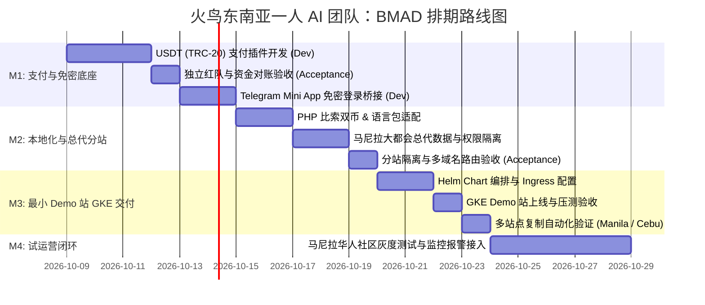

# BMAD 需求全景与一人 AI 团队排期计划 (Roadmap & Schedule)

> 本排期采用 **BMAD (Business-Model-Agent-Delivery)** 架构，由 **Dev Agent 编码** 与 **Acceptance Agent 独立验收** 双轨驱动。

---

## 一、 核心阶段里程碑 (Milestones)

---

## 二、 Epic 与 Task 规格矩阵

| 阶段 | Epic 编号 | 核心特性 (Feature) | Dev Agent 任务 | Acceptance Agent 验收标准 | 预计工期 |
| :--- | :--- | :--- | :--- | :--- | :--- |
| **M1** | `EPIC-PAY` | **火鸟原生 USDT 支付插件** | 在 `api/payment/usdt/` 编写标准插件，集成动态尾数与 TronGrid 监听器 | 模拟 10 笔链上充值、超时取消、尾数碰撞压力测试全部通过 | 3 天 |
| **M1** | `EPIC-AUTH` | **Telegram Mini App 免密桥接** | 校验 `initData` 签名并自动映射登录火鸟账号 | 伪造篡改 Hash 拦截率 100%，正常用户 1 秒免密进入 | 2 天 |
| **M2** | `EPIC-LOC` | **菲律宾本地化 (PHP/+63/双语)** | 注入 ₱ 比索符号、Twilio 短信与 en-US 语言字典 | 手机号短信下发成功，界面货币准确无误 | 2 天 |
| **M2** | `EPIC-AGENT`| **总代理与城市分站隔离** | 配置 `site_city`，绑定独立域名，验证 SQL 数据隔离 | 分站总代登录无法查阅其他分站订单与商家资金 | 3 天 |
| **M3** | `EPIC-GKE` | **GKE 最小 Demo 站与无限复制** | 编写 Helm Chart，打通 GitHub Actions 自动部署 | 执行 `helm upgrade -f values-manila.yaml` 30 秒拉起新站点 | 3 天 |
| **M4** | `EPIC-OPS` | **监控与自动化运维** | n8n 连通 Telegram，Sentry 报错经 AI 一句话定位 | 发生 500 错误 3 秒内在个人 TG 收到精准代码定位卡片 | 2 天 |

---

## 三、 BMAD 敏捷交付契约

1. **每个 Story 必须产出两份证据**：
   - Dev Agent 提交的 Git 代码变更与 Docs 变更。
   - Acceptance Agent 独立执行 `scripts/agent/qa.sh`（PR）/ `scripts/acceptance-runner.sh <TASK-ID>`（本地） 签发的验收报告。
2. **不允许跨越里程碑交付**：M1 的资金与鉴权底座必须获 Acceptance Agent 绿标签发，方可进入 M2 的总代理分站业务层。
