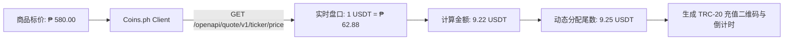

# Coins.ph 官方开放接口与双币结算集成规范 (Coins.ph Pro API)

> 官方文档参考：https://coins-access-api.readthedocs.io/ & https://api.pro.coins.ph  
> 核心实现：[`services/api/src/coinsPhClient.js`](file:///Users/arvin/Documents/firebird-sea/services/api/src/coinsPhClient.js)

---

## 1. 架构定位

在菲律宾本地化业务（外卖、跑腿、房产、招聘）中，前端统一采用**法定货币 ₱ (PHP)** 标价，结算时由本模块实时获取 Coins.ph 深度盘口，换算为 USDT 并附加防碰撞尾数：



---

## 2. API 接口规范

### 2.1 无需 Key 的公共接口 (Public API)
* **最新价格 (Ticker)**:
  `GET /openapi/quote/v1/ticker/price?symbol=USDTPHP`
  实测响应示例：
  ```json
  {"symbol": "USDTPHP", "price": "62.88"}
  ```
* **市场深度 (Order Book)**:
  `GET /openapi/quote/v1/depth?symbol=USDTPHP&limit=5`
  提供真实的顶级买单与卖单挂单列表。

### 2.2 需要 Key 的私有接口 (Private API / HMAC-SHA256)
* **鉴权算法**:
  1. 组织 Query String：`recvWindow=5000&timestamp=1700000000000`
  2. 计算签名：`signature = HMAC-SHA256(QueryString, API_SECRET)`
  3. 请求头携带：`X-COINS-APIKEY: your_api_key`
* **查询账户余额**:
  `GET /openapi/v1/account`

---

## 3. BMAD UI 看板与 GitHub 闭环集成
* **看板 UI**：位于 [`apps/bmad-dashboard/index.html`](file:///Users/arvin/Documents/firebird-sea/apps/bmad-dashboard/index.html)
* **数据同步**：运行 `make sync-gh` 自动聚合本地任务、验收报告并导出至看板数据源。
* **闭环链路**：`需求录入 ➔ Issue/Project看板 ➔ Dev 编码 ➔ QA 红队验收 (make accept) ➔ GKE 上线`
