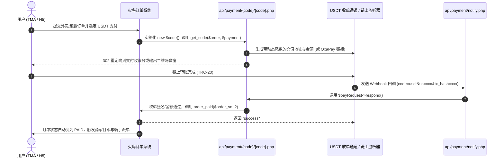

# 火鸟门户支付插件开发规约 (Payment Plugin Specification)

> 依据 `webroot/api/payment/paypal/` 与 `webroot/api/payment/notify.php` 逆向分析提炼。

---

## 1. 插件生命周期与调用链路



---

## 2. 核心类接口定义标准

每个支付插件必须位于 `webroot/api/payment/{pay_code}/` 目录下，主文件为 `{pay_code}.php`，类名与 `{pay_code}` 严格保持一致：

```php
<?php
if(!defined('HUONIAOINC')) exit('Request Error!');

/* 1. 插件元数据注册 (供后台支付方式管理列表渲染) */
if(isset($set_modules) && $set_modules == TRUE){
    $i = isset($payment) ? count($payment) : 0;
    $payment[$i]['pay_code'] = "usdt";
    $payment[$i]['pay_name'] = "USDT (TRC-20) 链上极速支付";
    $payment[$i]['title']    = "USDT Settlement";
    $payment[$i]['version']  = '1.0.0';
    $payment[$i]['pay_desc'] = '支持 TRC-20 / BEP-20 / TON 链上极速自动对账';
    $payment[$i]['author']   = 'Solo AI Team';
    $payment[$i]['website']  = 'https://fh580.net';

    /* 后台可配置项 */
    $payment[$i]['config'] = array(
        array('title' => '收款主地址 (TRC-20)', 'name' => 'master_address', 'type' => 'text'),
        array('title' => 'TronGrid API Key',     'name' => 'trongrid_key',   'type' => 'text'),
        array('title' => '结算模式',             'name' => 'mode',           'type' => 'select', 
              'options' => array('gateway' => '三方聚合网关 (OxaPay)', 'chain' => '自建尾数对账'))
    );
    return;
}

/* 2. 业务处理类 */
class usdt {
    /**
     * 发起支付生成收银台请求
     * @param array $order 订单数据 ['order_sn', 'order_amount', 'subject']
     * @param array $payment 后台配置参数
     */
    function get_code($order, $payment){
        // 生成包含动态尾数的收款单并唤起收银页面
    }

    /**
     * 异步通知处理 (被 api/payment/notify.php 调用)
     * @return bool 成功返回 true，失败返回 false
     */
    function respond(){
        loadPlug("payment");
        $order_sn = $_REQUEST['sn'];
        $tx_hash  = $_REQUEST['tx_hash'];

        // 校验签名与到账状态...
        if($verified){
            order_paid($order_sn, 2); // 核心：调用火鸟底层标记订单完成
            return true;
        }
        return false;
    }
}
```

---

## 3. 核心解耦收益

采用火鸟官方原生支付插件规范开发 `usdt` 插件后：
1. **零侵入性**：不需要修改火鸟任何外卖、商城、跑腿的核心业务源码。
2. **多业务通用**：无论是外卖订单、跑腿运费、房屋租金还是会员充值，只要前台用户选择 `usdt`，底层均能无缝完成资金清结算！
